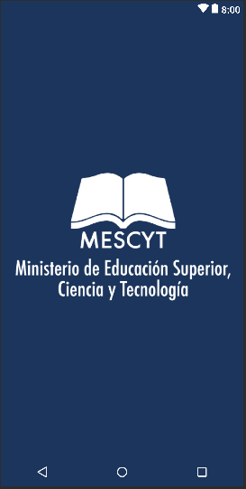
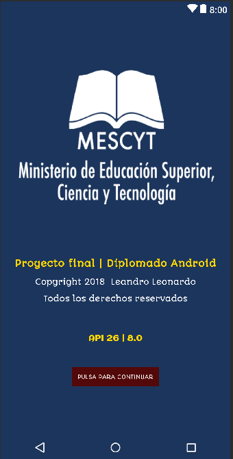
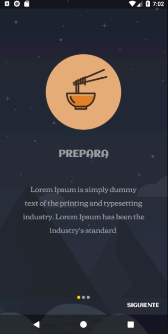
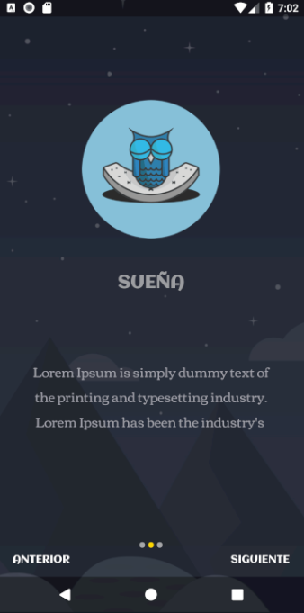
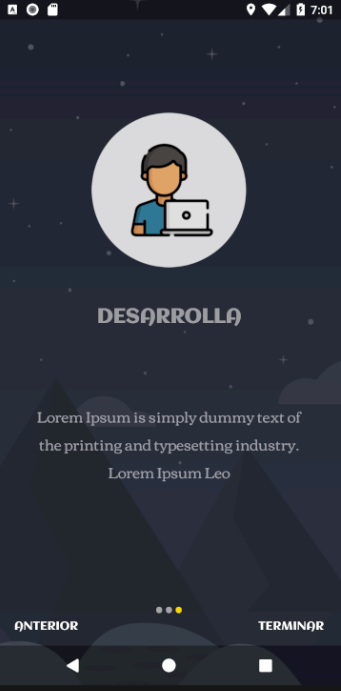
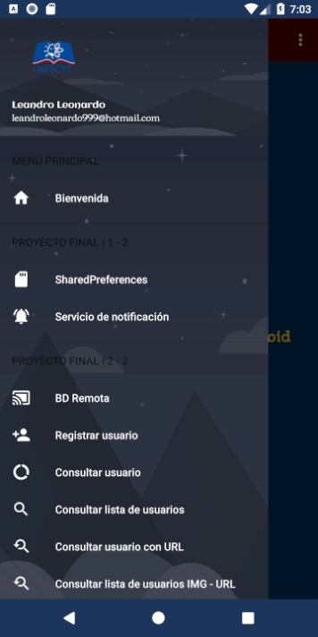
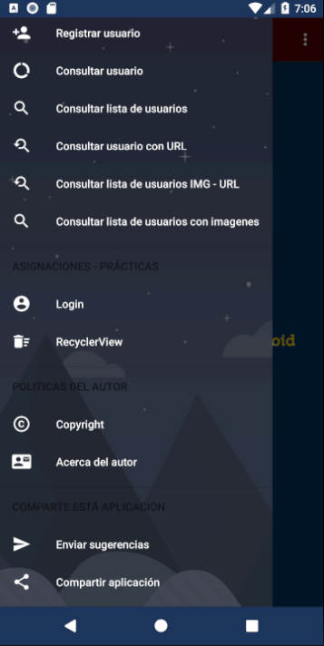

# PROYECTO FINAL 

This project will be used as a guide of presentation to the Android Development Course.
# ========================================
	API 26 | 8.0	TO	API 28
# ========================================

## Requerimientos

+ Share.
+ Consumir API REST.
+ Interfaz gráfica presentable.
+ Manejar cambios de configuración.
+ Servicio que muestre una notificación
+ Guardar información de manera local utilizando una BD.
+ Al menos tres (3) pantallas (celular, phoneblet, tablet).

# Screen Examples:

# Splash

# Bienvenida Activity

# Swipes Activity 1 - 3

# Swipes Activity 2 - 3

# Swipes Activity 3 - 3

# Menu Drawer Activity 1 - 3

# Menu Drawer Activity 2 - 3

# Menu Drawer Activity 3 - 3

# ========================================
   COPYRIGHT AND COPYLEFT 2018.
	LEANDRO LEONARDO ALL RIGHT RESERVED.
# ========================================

##### Download the app for to see more!

### Resources:
+ Volley
+ RecyclerView
+ Material Design
